# QA — redesign strony oferty (przed / po)

Pełne notatki z każdej rundy: [`notatki.md`](notatki.md). Skrypt zrzutów: [`shoot.js`](shoot.js). Builder stron: [`build_pages.py`](build_pages.py) (źródła treści prawnych w [`old/`](old/)).

## Hero — desktop 1440×900

| Przed (2026-10-07, wersja 1) | Po (runda 4, finał) |
|---|---|
| 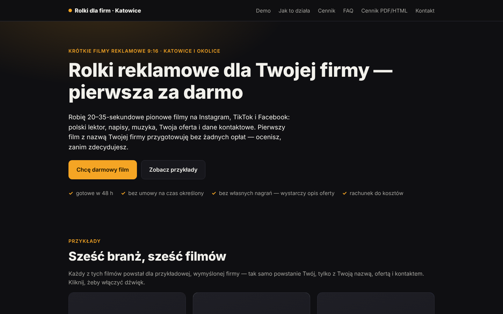 | 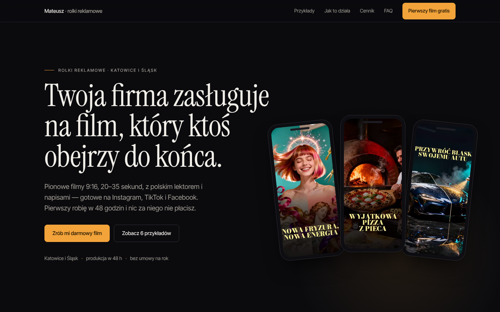 |

## Hero — mobile 390×844

| Przed | Po |
|---|---|
| 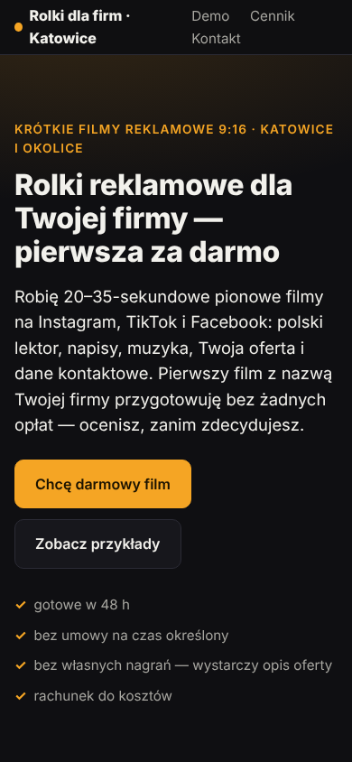 | 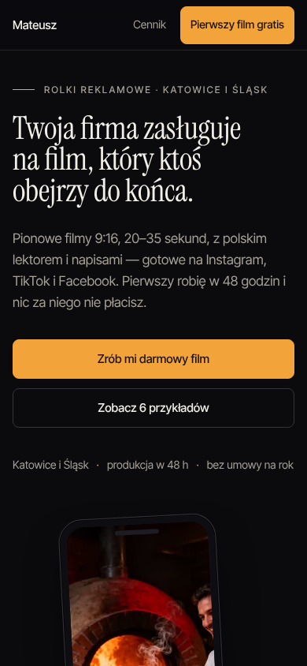 |

## Cała strona główna

| Przed | Po |
|---|---|
| 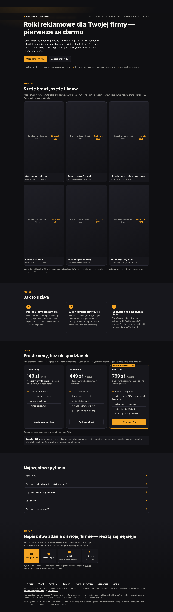 | 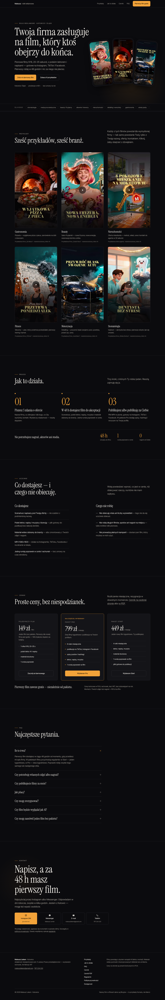 |

## Podstrony (finał, 1440)

| Cennik | Regulamin | Polityka prywatności | Dostępność | 404 |
|---|---|---|---|---|
| 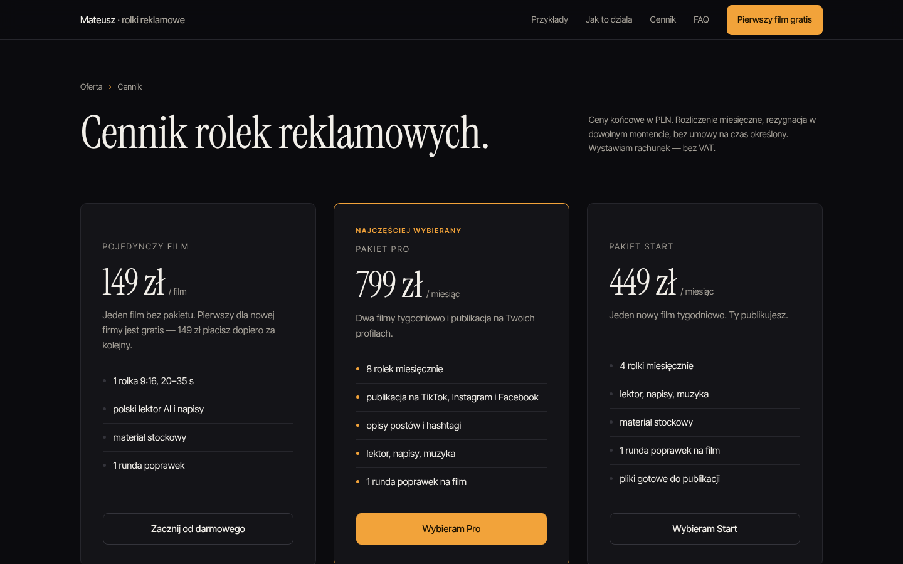 | 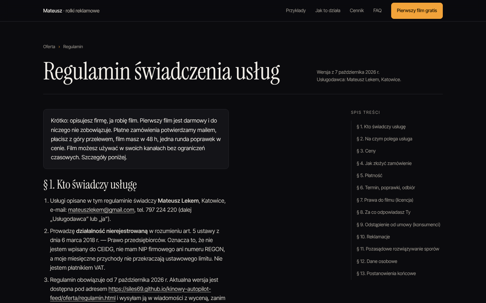 | 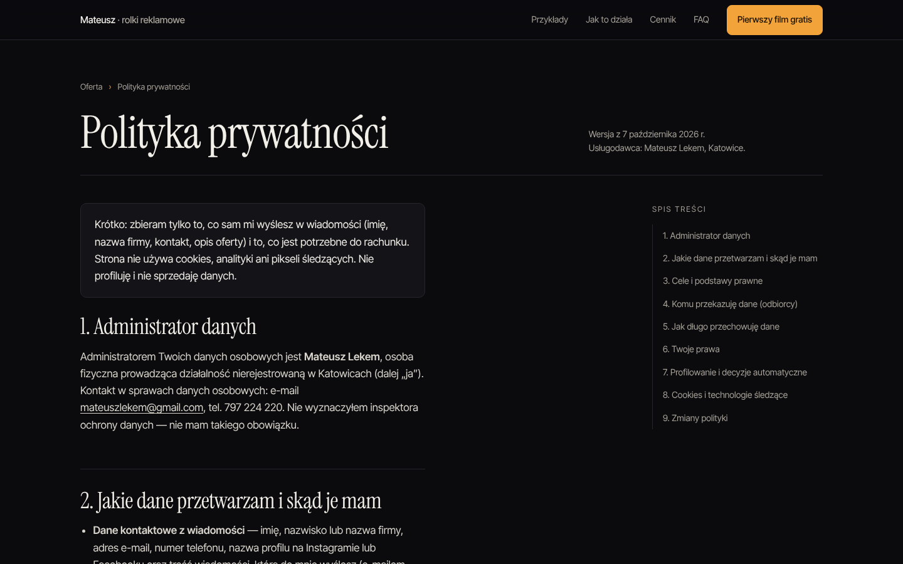 | 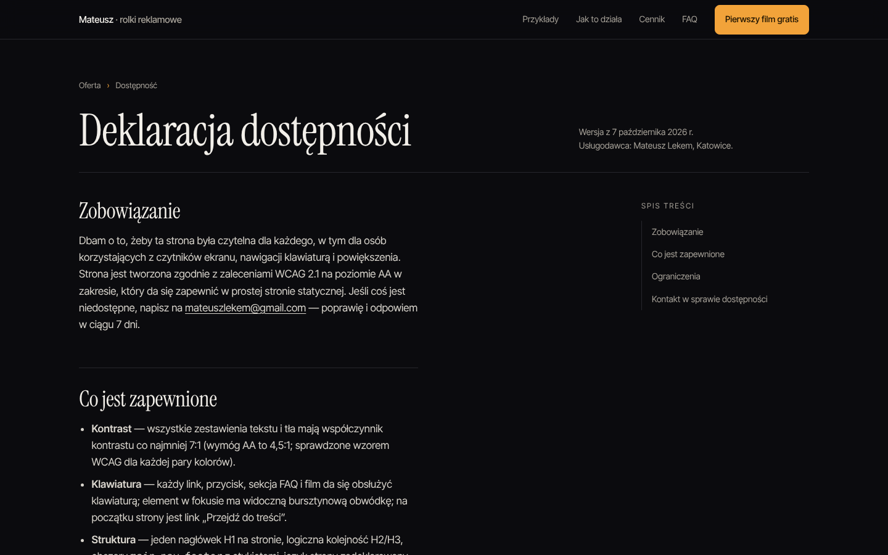 | 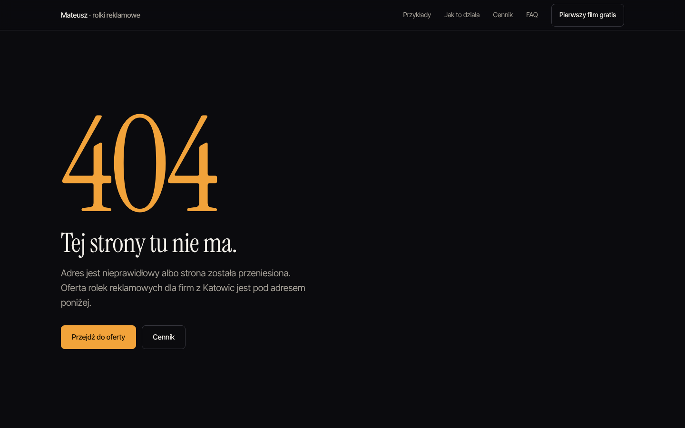 |

## Wyniki końcowe

- Rundy QA: 4 (zrzuty `round-1` … `round-4`, finał w `final/`); każda runda oceniana przez panel 8 agentów (po jednym na stronę, krytyk „premium / zakazane elementy”, sędzia spójności) + własny przegląd; poprawki opisane w `notatki.md`.
- Konsola przeglądarki: 0 błędów, 0 ostrzeżeń na 6 stronach. Zasoby HTTP ≥ 400: 0. Zasoby zewnętrzne: 0 (czcionki lokalne, brak skryptów zewnętrznych).
- Lighthouse 13.5 (index): desktop 100 / 100 / 100 / 100; mobile 97 / 100 / 100 / 100.
- Waga bez wideo i posterów: index ≈ 101 KB (HTML z inline CSS 58 KB + czcionki 43 KB w pierwszym widoku; wszystkie 10 plików czcionek: 136 KB), podstrony ≈ 115–127 KB. Limit: 300 KB.
- html-validate (preset recommended): 0 błędów. JSON-LD: parsuje się na każdej stronie, która go ma.
- Przyciski: min. 48 px. Kontrast: tekst 16,9:1, wyciszony 7,3:1, akcent 9,1:1 na tle.

## Checklista zakazanych elementów (finał)

| Element | Stan |
|---|---|
| emoji jako ikony | brak (ikony kontaktu to inline SVG) |
| trzy równe kolumny z ikonkami i 3-wyrazowymi nagłówkami | brak (kroki to linia czasu z numerami serif, bez ikon) |
| stockowe zdjęcia ludzi | brak (jedyne obrazy to klatki z filmów demo, rysunkowe) |
| badge „Nowość” / pigułki | brak (etykieta „Najczęściej wybierany” jako wiersz tekstu) |
| gradientowy tekst | brak |
| animowane bloby w tle | brak (dwie statyczne, bardzo subtelne poświaty radialne, przycięte do sekcji) |
| frazesy („Odblokuj potencjał”, „Rewolucja”, „wyższy poziom”) | brak |
| przyciski w 4 stylach | dwa style: pełny bursztyn i obrys 1 px |
| lorem / placeholdery | brak (`grep -i "lorem\|TODO"` → 0) |
| identyczne karty w nieskończonym gridzie | 6 kart demo z różnym kadrem i treścią; 3 karty cennika |
